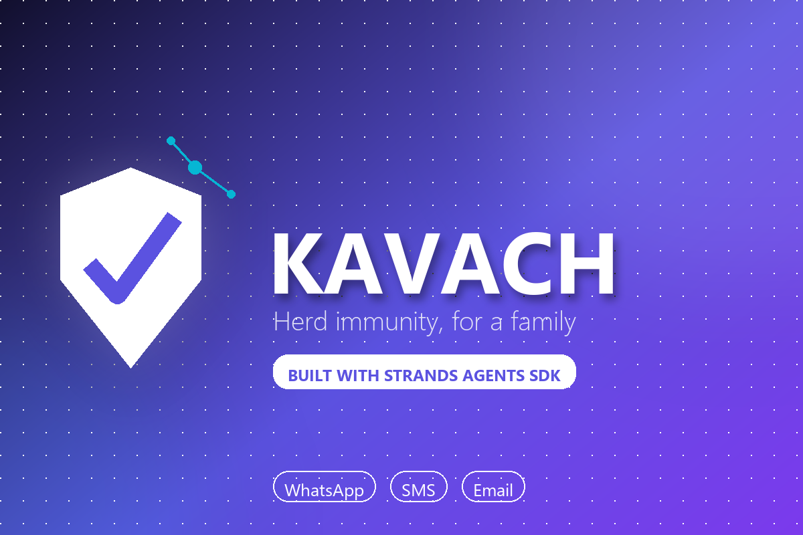
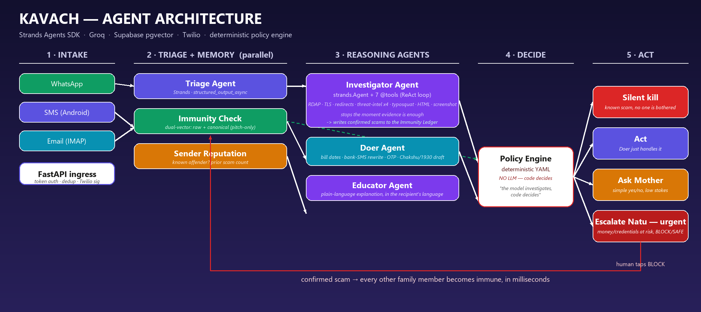
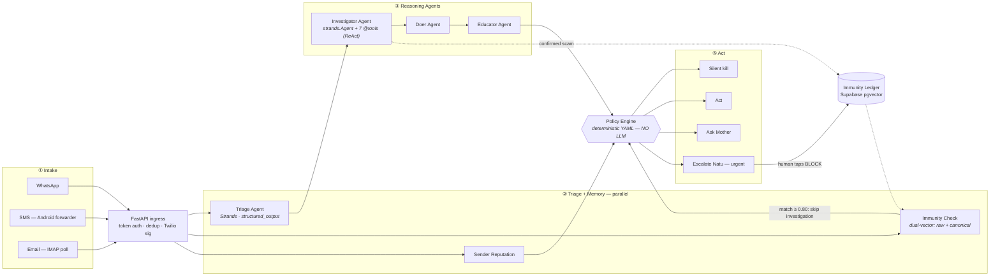
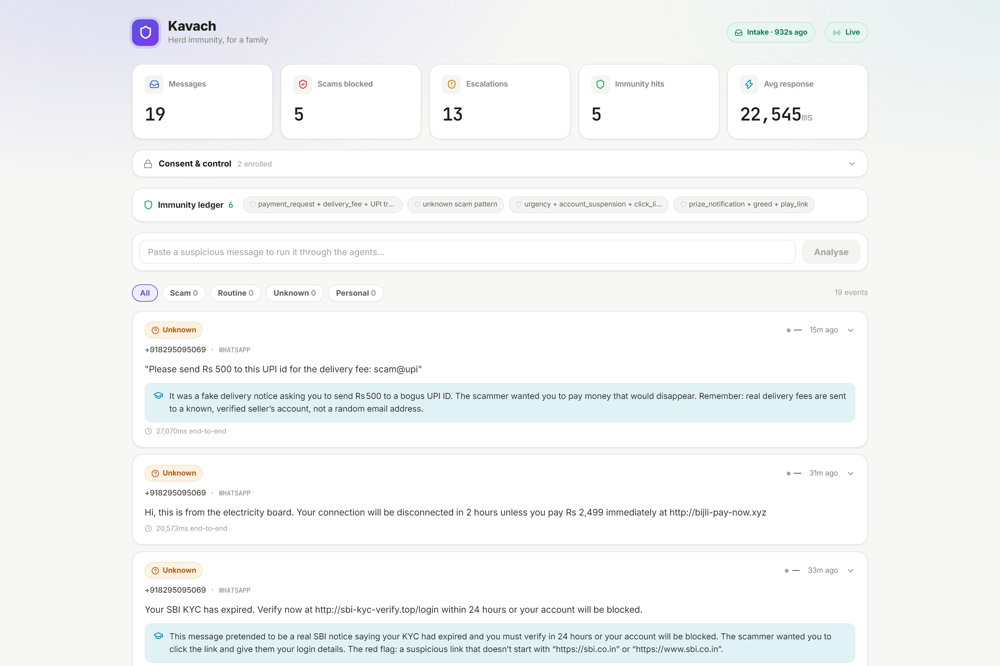
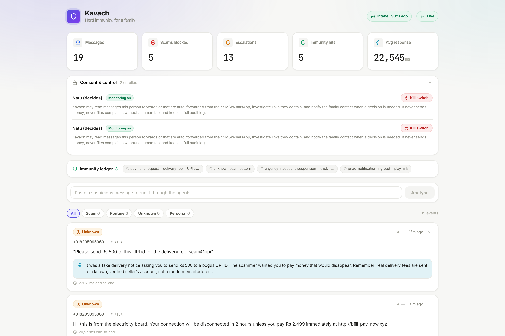
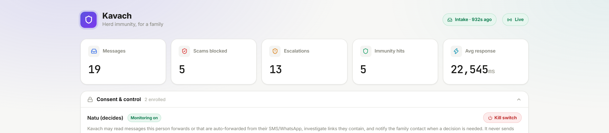

<div align="center">



# 🛡️ Kavach

**An autonomous, multi-agent scam-protection system for family groups —**
**when one member is targeted, everyone else becomes immune within seconds.**

[](https://github.com/strands-agents/sdk-python)
[](https://groq.com)
[](./LICENSE)
[](https://kavach-frontend-v6nt.onrender.com)

[**🚀 Live Demo**](https://kavach-frontend-v6nt.onrender.com) · [**📐 Architecture**](#-architecture) · [**⚡ Quickstart**](#-quickstart) · [**🧠 How it thinks**](#-how-it-thinks) · [**🗺️ Roadmap**](#️-whats-next)

</div>

---

## Why Kavach

Every family has one person who quietly becomes everyone else's tech support — the one who gets the panicked forward at 11pm: *"beta, is this message real?"*

Scammers rotate phone numbers and URLs constantly, but they **reuse the same pitch**. Blocklists miss that completely. If one family member gets targeted and figures it out, that knowledge usually dies in a single WhatsApp thread — it never reaches the parent three towns over who's about to get the exact same message with a different link.

**Kavach is an agent that investigates, decides, and remembers** — so the second person it protects benefits automatically from what happened to the first, in milliseconds, with no one lifting a finger.

> *"The model investigates. Code decides."* — every irreversible action is gated by a deterministic policy engine, never by an LLM alone.

---

## ✨ What it does

| | |
|---|---|
| 📡 **Automatic, multi-channel intake** | WhatsApp (Twilio), an Android SMS-forwarder, and a background IMAP poller for email — nothing to remember to forward |
| 🕵️ **A genuinely agentic Investigator** | A [Strands](https://github.com/strands-agents/sdk-python) `Agent` with 7 forensic `@tool`s decides for itself which to run and stops the moment it has enough evidence |
| 🩹 **Herd immunity** | A confirmed scam's *semantic pitch* — not just its URL — is embedded and stored. Every later message from anyone else in the family is checked against it **before** a full investigation runs |
| ⚖️ **A deterministic policy engine** | Plain YAML rules — no LLM — decide: block silently, act automatically, ask a simple yes/no, or escalate urgently. Two different humans can be in the loop: the person protected, and the person who decides |
| 🤖 **A Doer agent that does real work** | Extracts bill due-dates, rewrites cryptic bank SMS into plain language, explains OTPs, and drafts (never auto-files) a Chakshu/1930 cyber-fraud complaint |
| 🎓 **An Educator agent** | Writes a 2-sentence, plain-language "why" in the recipient's own language (English/Hindi/Hinglish), so they get better at spotting the next one |
| 🔒 **Real consent + a real kill switch** | Every member has a recorded consent scope and a visible audit log; anyone can be paused instantly from the dashboard |

---

## 📐 Architecture

<div align="center">

</div>

<details>
<summary><strong>Same flow, as a Mermaid diagram (renders natively on GitHub)</strong></summary>



</details>

### The escalation ladder

| Situation | Decided by | Action |
|---|---|---|
| Immunity match, high similarity | *nobody* | Silent kill, logged |
| Known-bad domain, corroborated by threat intel | *nobody* | Silent kill, logged |
| Routine admin, reversible | *nobody* | Agent acts, appears in the daily digest |
| Unknown sender, no money/credentials at stake | **Mother** (protected person) | Simple yes/no on WhatsApp |
| Money, credentials, or account access at risk | **Natu** (trusted decider) | One-tap BLOCK / SAFE |
| Suspected active compromise | **Natu** | Immediate escalation |
| Confirmed fraud, victim engaged | **Natu** | Chakshu / 1930 complaint pre-filled, held for one tap |

Two different humans, deliberately: the person being protected is rarely the person best placed to decide.

---

## 🧠 How it thinks

The Investigator is the centrepiece — a real [Strands](https://github.com/strands-agents/sdk-python) `Agent`, not a fixed pipeline:

```
thought       "Let me check threat intel on the primary URL first."
tool_call     check_threat_intelligence({url: "http://sbi-kyc-verify.top/login"})
observation   {known_malicious: true, phishtank_hit: true, ...}
verdict       SCAM (97%) — confirmed on PhishTank + URLhaus, no further checks needed
```

A confirmed-malicious hit ends the investigation in **one** tool call. An unclear case makes it dig through domain age, TLS cert, redirect chains, brand-impersonation/homograph detection, and landing-page credential-harvesting analysis — up to 7 tools, only the ones it decides it needs. Every step is captured and animated on the dashboard, live.

The **immunity ledger** is why this scales across a family instead of protecting one inbox at a time:

```
Member 1 — "Your SBI KYC has expired. Verify at http://sbi-kyc-verify.top/login…"
  → full investigation: ~15–25 seconds → confirmed scam → signature written

Member 2 — "SBI: KYC verification pending. Update via http://sbi-secure-kyc.info/renew…"
  → canonical-vector match on the *pitch*, not the URL → silently killed in < 1 second
```

Same scam, rotated number, rotated link, same semantic shape — caught instantly.

---

## 🖥️ The dashboard

<table>
<tr><td width="60%">

**Live overview** — messages, scams blocked, escalations, immunity hits, average response time, all updating over Server-Sent Events as messages arrive.

</td></tr>
</table>



<details>
<summary><strong>More screenshots — consent & kill switch, header detail</strong></summary>

<br/>

**Consent & control** — every enrolled member's recorded consent scope, with a one-tap kill switch that genuinely stops the pipeline from reading that person's messages:



**Header + live stats:**



</details>

---

## 🛠️ Tech stack

| Layer | Technology |
|---|---|
| **Agent framework** | [Strands Agents SDK](https://github.com/strands-agents/sdk-python) — 4 agents: Triage, Investigator (ReAct + 7 tools), Doer, Educator |
| **LLM** | [Groq](https://groq.com) — `openai/gpt-oss-120b` (investigator) · `openai/gpt-oss-20b` (everything else), via Strands' OpenAI-compatible model interface |
| **Embeddings** | [fastembed](https://github.com/qdrant/fastembed) — local, no API key, `BAAI/bge-small-en-v1.5` |
| **Database** | [Supabase](https://supabase.com) Postgres + **pgvector** — dual-vector immunity search (raw + canonical/pitch-only) |
| **Backend** | FastAPI · Server-Sent Events · APScheduler (daily digest, email poll) |
| **Frontend** | React 19 · TypeScript · Vite · a from-scratch design system with an animated agent-reasoning trace |
| **Messaging** | Twilio (WhatsApp intake + escalations) · Android SMS-forwarder · stdlib IMAP |
| **Deploy** | [Render](https://render.com) (Docker backend + static frontend) · a Bedrock AgentCore entrypoint is written and ready as a next step |

---

## ⚡ Quickstart

```bash
# ── Backend ───────────────────────────────────────────────────────────
cd backend
python -m venv .venv && .venv\Scripts\activate      # or: source .venv/bin/activate
pip install -r requirements.txt
cp .env.example .env                                 # fill in Groq + Supabase + Twilio keys
# run backend/app/db/schema_full.sql once in the Supabase SQL editor
uvicorn app.main:app --reload --port 8000

# ── Frontend ──────────────────────────────────────────────────────────
cd frontend
npm install
npm run dev
```

Open `http://localhost:5173`, paste a suspicious message into the test box, and watch the agents work. Full setup detail (Groq key, Supabase schema, Twilio sandbox, SMS forwarder, email poller) is in [`INTAKE_SETUP.md`](./INTAKE_SETUP.md) and [`RUNBOOK.md`](./RUNBOOK.md).

### Run the tests
```bash
cd backend
python tests/test_enhancements_offline.py   # 28 assertions, no network, no keys needed
python -m eval.eval_runner                  # triage precision/recall on 250 labelled messages
python -m eval.pipeline_eval --immunity     # end-to-end + the herd-immunity propagation benchmark
```

---

## 📁 Project structure

```
kavach/
├── backend/
│   ├── app/
│   │   ├── agents/            # Triage, Investigator (+ ReAct loop + tool registry), Doer, Educator
│   │   ├── memory/             # immunity ledger (dual-vector), sender reputation, signature extraction
│   │   ├── policy/              # engine.py + rules.yaml — the deterministic decision layer
│   │   ├── db/                  # Supabase client, audit events, pending-escalation correlation
│   │   ├── notifier/            # Twilio WhatsApp
│   │   ├── email_intake.py      # IMAP poller
│   │   ├── digest.py            # daily summary
│   │   ├── tasks.py             # background-task helper (see "Lessons learned")
│   │   └── main.py              # FastAPI app — webhooks, SSE, consent, dashboard API
│   ├── agentcore_app.py         # Bedrock AgentCore Runtime entrypoint (ready, not required)
│   ├── eval/                    # labelled datasets + evaluation runners
│   └── tests/                   # offline test suite
├── frontend/
│   └── src/
│       ├── components/          # Dashboard, EventCard (the animated trace lives here)
│       └── hooks/                # SSE + API hooks
├── architecture.png
├── plan.md                      # the original 10-day build plan
└── render.yaml                   # one-command deploy blueprint
```

---

## 🩹 Lessons learned (the honest version)

Building this surfaced a few real, non-obvious bugs worth naming:

- **A classic asyncio trap, in production.** WhatsApp escalations worked locally but silently vanished once deployed. Several background jobs were started with bare `asyncio.create_task()` and never referenced again — the event loop only holds a *weak* reference to an unreferenced task, so under real memory pressure it can be garbage-collected mid-flight, with no error anywhere. Fixed with a small [`spawn()`](./backend/app/tasks.py) helper that keeps a strong reference to every background task until it finishes.
- **Webhook signatures behind a proxy.** Render's edge meant the reconstructed request URL didn't always match what Twilio signed against — the validator now tries several candidate URLs instead of trusting one reconstruction.
- **Cloud access, twice.** A regional Azure OpenAI policy block, then a university tenant's Security Defaults denying Azure Resource Manager entirely. Pivoted the model provider to Groq and the deployment to Render rather than keep fighting infrastructure that wasn't ours to unblock.
- **512MB of RAM.** Headless Chromium (for the investigator's screenshot tool) doesn't comfortably coexist with the local embedding model on a free-tier instance — it's now a feature flag, and the other six forensic tools are unaffected.

---

## 🗺️ What's next

- [ ] Deploy the agent layer on **Bedrock AgentCore Runtime** (entrypoint already written)
- [ ] Passive WhatsApp capture via an Android Notification Listener — fully optional forwarding
- [ ] Broaden the Doer agent's task set and the Educator's language coverage
- [ ] Full-pipeline eval numbers (precision/recall/false-positive rate) published in-repo

---

## 📄 License

[MIT](./LICENSE) — see the file for details.

<div align="center">

*Built for the AWS "Agents for Humans" hackathon — Good Neighbor Agents track.*

**[Live demo](https://kavach-frontend-v6nt.onrender.com)** · **[Report an issue](https://github.com/princegarg001/kavach/issues)**

</div>
